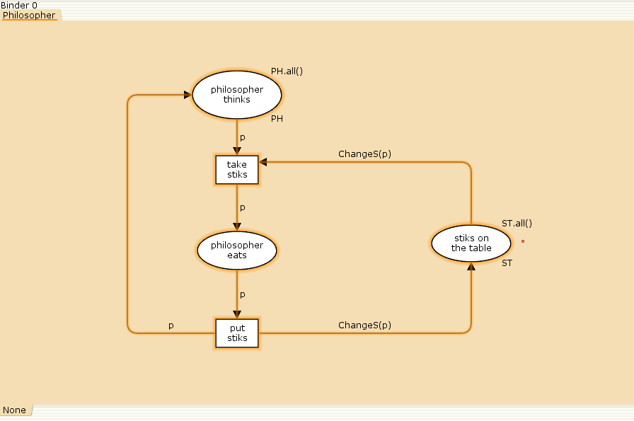

---
## Front matter
title: "Лабораторная работа №10"
subtitle: "Задача об обедающих мудрецах"
author: "Шуваев Сергей Александрович"

## Generic otions
lang: ru-RU
toc-title: "Содержание"

## Bibliography
bibliography: bib/cite.bib
csl: pandoc/csl/gost-r-7-0-5-2008-numeric.csl

## Pdf output format
toc: true # Table of contents
toc-depth: 2
lof: true # List of figures
lot: false # List of tables
fontsize: 12pt
linestretch: 1.5
papersize: a4
documentclass: scrreprt
## I18n polyglossia
polyglossia-lang:
  name: russian
  options:
	- spelling=modern
	- babelshorthands=true
polyglossia-otherlangs:
  name: english
## I18n babel
babel-lang: russian
babel-otherlangs: english
## Fonts
mainfont: PT Serif
romanfont: PT Serif
sansfont: PT Sans
monofont: PT Mono
mainfontoptions: Ligatures=TeX
romanfontoptions: Ligatures=TeX
sansfontoptions: Ligatures=TeX,Scale=MatchLowercase
monofontoptions: Scale=MatchLowercase,Scale=0.9
## Biblatex
biblatex: true
biblio-style: "gost-numeric"
biblatexoptions:
  - parentracker=true
  - backend=biber
  - hyperref=auto
  - language=auto
  - autolang=other*
  - citestyle=gost-numeric
## Pandoc-crossref LaTeX customization
figureTitle: "Рис."
tableTitle: "Таблица"
listingTitle: "Листинг"
lofTitle: "Список иллюстраций"
lotTitle: "Список таблиц"
lolTitle: "Листинги"
## Misc options
indent: true
header-includes:
  - \usepackage{indentfirst}
  - \usepackage{float} # keep figures where there are in the text
  - \floatplacement{figure}{H} # keep figures where there are in the text
---

# Введение

**Цель работы**

Реализовать модель задачи об обедающих мудрецах в CPN Tools.

**Задание**

- Реализовать модель задачи об обедающих мудрецах  в CPN Tools;
- Вычислить пространство состояний, сформировать отчет о нем и построить граф.

# Выполнение лабораторной работы

**Постановка задачи**

Пять мудрецов сидят за круглым столом и могут пребывать в двух состояниях --
думать и есть. Между соседями лежит одна палочка для еды. Для приёма пищи
необходимы две палочки. Палочки -- пересекающийся ресурс. Необходимо синхронизировать процесс еды так, чтобы мудрецы не умерли с голода. 

Рисуем граф сети. Для этого с помощью контекстного меню создаём новую сеть,
добавляем позиции, переходы и дуги (рис. [-@fig:001]).

Начальные данные:

- позиции: мудрец размышляет (philosopher thinks), мудрец ест (philosopher eats),
палочки находятся на столе (sticks on the table)
- переходы: взять палочки (take sticks), положить палочки (put sticks)

{#fig:001 width=70%}

В меню задаём новые декларации модели (рис. [-@fig:002]): типы фишек, начальные значения
позиций, выражения для дуг:

- $n$ — число мудрецов и палочек $(n = 5)$;
- $p$ — фишки, обозначающие мудрецов, имеют перечисляемый тип `PH` от 1 до $n$;
- $s$ — фишки, обозначающие палочки, имеют перечисляемый тип `ST` от 1 до $n$;
- функция `ChangeS(p)` ставит в соответствие мудрецам палочки (возвращает номера палочек, используемых мудрецами); по условию задачи мудрецы сидят по
кругу и мудрец $p(i)$ может взять $i$ и $i + 1$ палочки, поэтому функция `ChangeS(p)`
определяется следующим образом:

```
fun ChangeS (ph(i))=
1`st(i)++st(if = n then 1 else i+1)
```

{#fig:002 width=70%}

В результате получаем работающую модель (рис. [-@fig:003]).

{#fig:003 width=70%}

После запуска модели наблюдаем, что одновременно палочками могут воспользоваться только два из пяти мудрецов (рис. [-@fig:004]).

{#fig:004 width=70%}

## Упражнение

Вычислим пространство состояний. Прежде, чем пространство состояний может быть вычислено и проанализировано, необходимо сформировать код пространства состояний. Этот код создается, когда используется инструмент Войти в пространство состояний. Вход в пространство состояний занимает некоторое время. Затем, если ожидается, что пространство состояний будет небольшим, можно просто применить инструмент Вычислить пространство состояний к листу, содержащему страницу сети. Сформируем отчёт о пространстве состояний и проанализируем его.  Чтобы сохранить отчет, необходимо применить инструмент Сохранить отчет о пространстве состояний к листу, содержащему страницу сети и ввести имя файла отчета.

Из отчета можем узнать, что:

- есть 11 состояний и 30 переходов между ними;
- указаны границы значений для каждого элемента: думающие мудрецы (максимум - 5, минимум - 3), мудрецы едят (максимум - 2, минимум - 0), палочки на столе (максимум - 5, минимум - 1, минимальное значение 2, так как в конце симуляции остаются пирожки);
- указаны границы в виде мультимножеств;
- маркировка home для всех состояний;
- маркировка dead равна None;
- указано, что бесконечно часто происходят события положить и взять палочку.

```
CPN Tools state space report for:
/home/openmodelica/philosopher.cpn
Report generated: Sat May 25 00:45:34 2024

 Statistics
------------------------------------------------------------------------

  State Space
     Nodes:  11
     Arcs:   30
     Secs:   0
     Status: Full

  Scc Graph
     Nodes:  1
     Arcs:   0
     Secs:   0


 Boundedness Properties
------------------------------------------------------------------------

  Best Integer Bounds
                             Upper      Lower
     philosopher'philosopher_eats 1
                             2          0
     philosopher'philosopher_thinks 1
                             5          3
     philosopher'sticks_on_the_table 1
                             5          1

  Best Upper Multi-set Bounds
     philosopher'philosopher_eats 1
                         1`ph(1)++
1`ph(2)++
1`ph(3)++
1`ph(4)++
1`ph(5)
     philosopher'philosopher_thinks 1
                         1`ph(1)++
1`ph(2)++
1`ph(3)++
1`ph(4)++
1`ph(5)
     philosopher'sticks_on_the_table 1
                         1`st(1)++
1`st(2)++
1`st(3)++
1`st(4)++
1`st(5)

  Best Lower Multi-set Bounds
     philosopher'philosopher_eats 1
                         empty
     philosopher'philosopher_thinks 1
                         empty
     philosopher'sticks_on_the_table 1
                         empty


 Home Properties
------------------------------------------------------------------------

  Home Markings
     All


 Liveness Properties
------------------------------------------------------------------------

  Dead Markings
     None

  Dead Transition Instances
     None

  Live Transition Instances
     All


 Fairness Properties
------------------------------------------------------------------------
       philosopher'put_sticks 1
                         Impartial
       philosopher'take_stiicks 1
                         Impartial
```

Построим граф пространства состояний (рис. [-@fig:005]).

{#fig:005 width=70%}

# Выводы

В процессе выполнения данной лабораторной работы я реализовал модель задачи об обедающих мудрецах в CPN Tools.