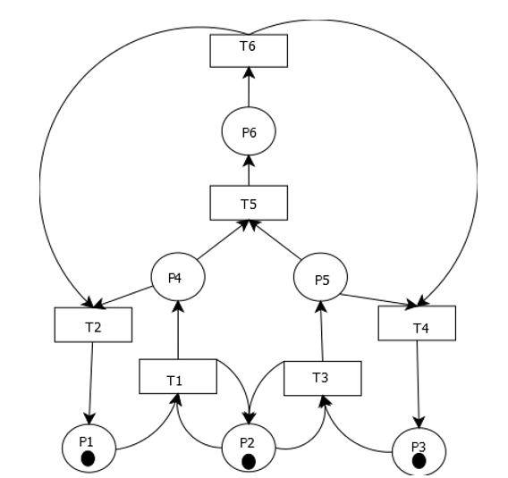
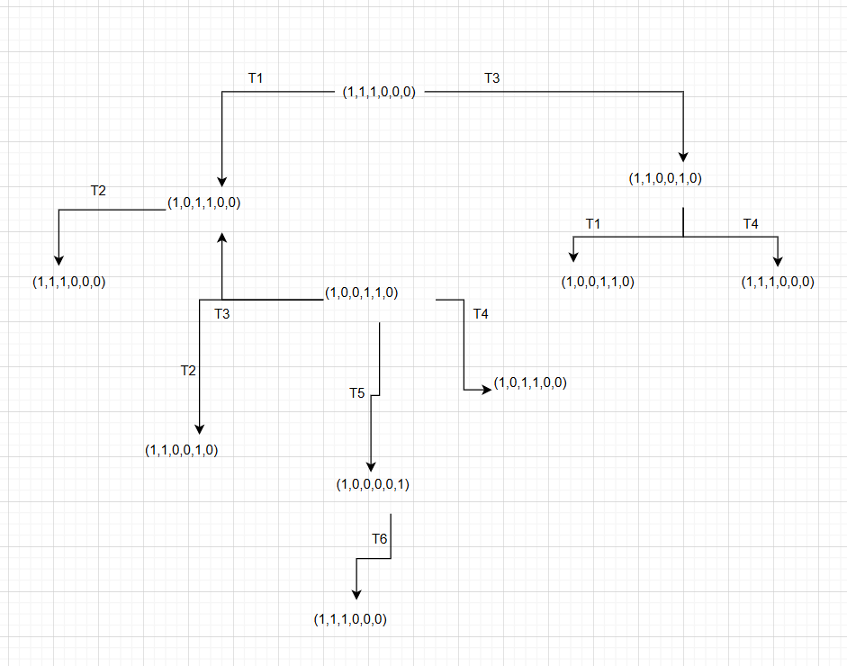
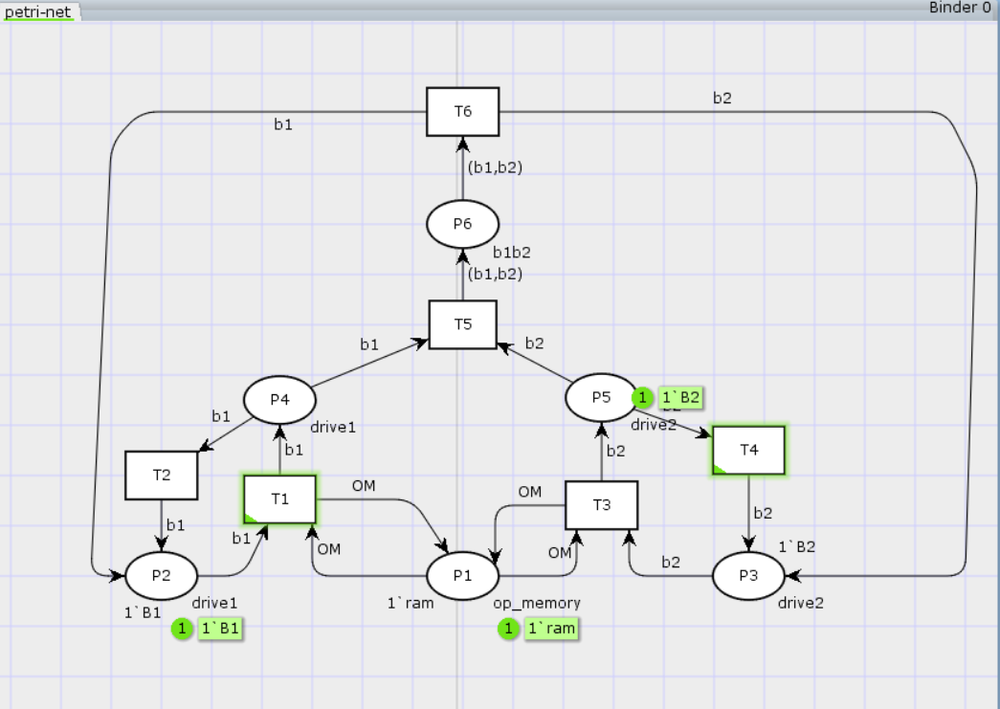
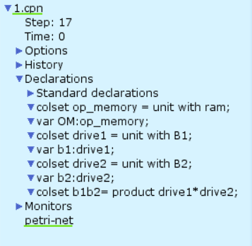
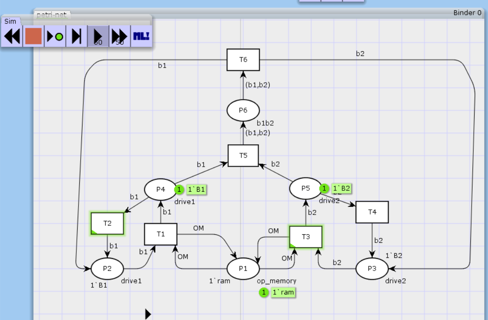
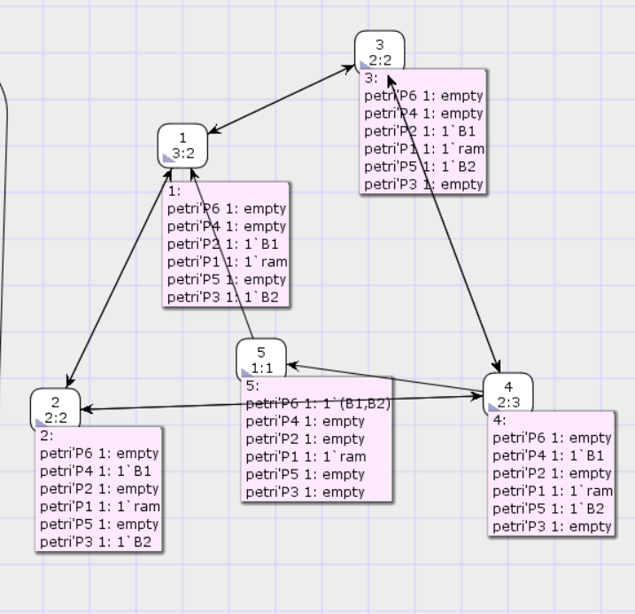
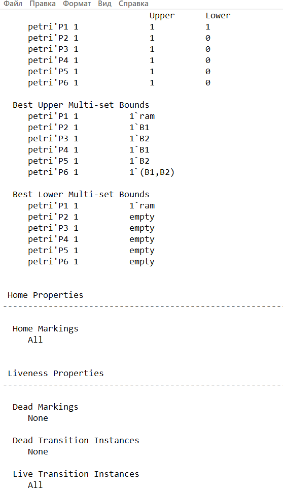

---
## Front matter
title: "Лабораторная работа №13"
subtitle: "Задание для самостоятельного выполнения"
author: "Шуваев Сергей Александрович"

## Generic otions
lang: ru-RU
toc-title: "Содержание"

## Bibliography
bibliography: bib/cite.bib
csl: pandoc/csl/gost-r-7-0-5-2008-numeric.csl

## Pdf output format
toc: true # Table of contents
toc-depth: 2
lof: true # List of figures
lot: false # List of tables
fontsize: 12pt
linestretch: 1.5
papersize: a4
documentclass: scrreprt
## I18n polyglossia
polyglossia-lang:
  name: russian
  options:
	- spelling=modern
	- babelshorthands=true
polyglossia-otherlangs:
  name: english
## I18n babel
babel-lang: russian
babel-otherlangs: english
## Fonts
mainfont: PT Serif
romanfont: PT Serif
sansfont: PT Sans
monofont: PT Mono
mainfontoptions: Ligatures=TeX
romanfontoptions: Ligatures=TeX
sansfontoptions: Ligatures=TeX,Scale=MatchLowercase
monofontoptions: Scale=MatchLowercase,Scale=0.9
## Biblatex
biblatex: true
biblio-style: "gost-numeric"
biblatexoptions:
  - parentracker=true
  - backend=biber
  - hyperref=auto
  - language=auto
  - autolang=other*
  - citestyle=gost-numeric
## Pandoc-crossref LaTeX customization
figureTitle: "Рис."
tableTitle: "Таблица"
listingTitle: "Листинг"
lofTitle: "Список иллюстраций"
lotTitle: "Список таблиц"
lolTitle: "Листинги"
## Misc options
indent: true
header-includes:
  - \usepackage{indentfirst}
  - \usepackage{float} # keep figures where there are in the text
  - \floatplacement{figure}{H} # keep figures where there are in the text
---

# Постановка задачи

1. Используя теоретические методы анализа сетей Петри, провести анализ сети (с помощью построения дерева достижимости). Определить, является ли сеть безопасной, ограниченной, сохраняющей, имеются ли
тупики.
2. Промоделировать сеть Петри с помощью CPNTools.
3. Вычислить пространство состояний. Сформировать отчёт о пространстве состояний и проанализировать его.Построить граф пространства состояний.

# Выполнение лабораторной работы

## Схема модели

Заявка (команды программы, операнды) поступает в оперативную память (ОП), затем
передается на прибор (центральный процессор, ЦП) для обработки. После этого
заявка может равновероятно обратиться к оперативной памяти или к одному из двух
внешних запоминающих устройств (B1 и B2). Прежде чем записать информацию на
внешний накопитель, необходимо вторично обратиться к центральному процессору,
определяющему состояние накопителя и выдающему необходимую управляющую
информацию. Накопители (B1 и B2) могут работать в 3-х режимах:

1) B1 — занят, B2 — свободен;
2) B2 — свободен, B1 — занят;
3) B1 — занят, B2 — занят.

## Описание модели

Сеть Петри моделируемой системы представлена на рис. [-@fig:001].

Множество позиций:

P1 — состояние оперативной памяти (свободна / занята);

P2 — состояние внешнего запоминающего устройства B1 (свободно / занято);

P3 — состояние внешнего запоминающего устройства B2 (свободно / занято);

P4 — работа на ОП и B1 закончена;

P5 — работа на ОП и B2 закончена;

P6 — работа на ОП, B1 и B2 закончена;

Множество переходов:

T1 — ЦП работает только с RAM и B1;

T2 — обрабатываются данные из RAM и с B1 переходят на устройство вывода;

T3 — CPU работает только с RAM и B2;

T4 — обрабатываются данные из RAM и с B2 переходят на устройство вывода;

T5 — CPU работает только с RAM и с B1, B2;

T6 — обрабатываются данные из RAM, B1, B2 и переходят на устройство вывода.

Функционирование сети Петри можно расматривать как срабатывание переходов,
в ходе которого происходит перемещение маркеров по позициям:

- работа CPU с RAM и B1 отображается запуском перехода T1 (удаление маркеров
из P1, P2 и появление в P1, P4), что влечет за собой срабатывание перехода T2,
т.е. передачу данных с RAM и B1 на устройство вывода;
- работа CPU с RAM и B2 отображается запуском перехода T3 (удаление маркеров
из P1 и P3 и появление в P1 и P5), что влечет за собой срабатывание перехода T4,
т.е. передачу данных с RAM и B2 на устройство вывода;
- работа CPU с RAM, B1 и B2 отображается запуском перехода T5 (удаление
маркеров из P4 и P5 и появление в P6), далее срабатывание перехода T6, и данные
из RAM, B1 и B2 передаются на устройство вывода;
- состояние устройств восстанавливается при срабатывании: RAM — переходов
T1 или T2; B1 — переходов T2 или T6; B2 — переходов T4 или T6.

{#fig:001 width=70%}

## Анализ сети Петри

Построим дерево достижимости (рис. [-@fig:002]).

{#fig:002 width=70%}

Можем увидеть, что представленная сеть:

- безопасна, поскольку в каждой
позиции количество фишек не превышает 1;
- ограничена, так как существует такое целое k, что число
фишек в каждой позиции не может превысить k (в данном случае k=1);
- сеть не имеет тупиков;
- сеть не является сохраняющей, так как при переходах t5 и t6 количество фишек меняется.

## Реализация модели в CPN Tools

Реализуем описанную ранее модель в CPN Tools. С помощью контекстного меню создаем новую сеть, далее нам понадобятся 6 позиций и 6 блоков переходов, затем их нужно соединить, а также задать параметры и начальные значения. Получаем готовую модель (рис. [-@fig:003]).

{#fig:003 width=70%}

Также зададим нужные декларации (рис. [-@fig:004]).

{#fig:004 width=70%}

Запустив модель, можно посмотреть, как она работает (рис. [-@fig:005]).

{#fig:005 width=70%}

## Пространство состояний

Изучим пространство состояний. Сформируем граф пространства состояний, их всего 5 ([-@fig:006]).

{#fig:006 width=70%}

Вычислим пространство состояний. Прежде, чем пространство состояний может быть вычислено и проанализировано, необходимо сформировать код пространства состояний. Этот код создается, когда используется инструмент Войти в пространство состояний. Вход в пространство состояний занимает некоторое время. Затем, если ожидается, что пространство состояний будет небольшим, можно просто применить инструмент Вычислить пространство состояний к листу, содержащему страницу сети. Сформируем отчёт о пространстве состояний и проанализируем его.  Чтобы сохранить отчет, необходимо применить инструмент Сохранить отчет о пространстве состояний к листу, содержащему страницу сети и ввести имя файла отчета.

{#fig:007 width=70%}

Из отчета можно увидеть:

- есть 5 состояний и 10 переходов между ними, strongly connected components (SCC) graph содержит 1 вершину и 0 переходов.
- Затем указаны границы значений для каждого элемента: состояние P1 всегда заполнено 1 элементом, а остальные содержат максимум 1 элемент, минимум -- 0.
- Также указаны границы в виде мультимножеств.
- Маркировка home для всех состояний, так как в любую позицию мы можем попасть из любой другой маркировки.
- Маркировка dead равная None, так как нет состояний, из которых переходов быть не может.
- В конце указано, что бесконечно часто могут происходить переходы T1, T2, T3, T4, но не обязательно, также состояние T5 необходимо для того, чтобы система не попадала в тупик, а состояние T6 происходит всегда, если доступно.

```
CPN Tools state space report for:
/home/openmodelica/petri_net.cpn
Report generated: Sat Jun  1 00:38:28 2024

 Statistics
------------------------------------------------------------------------

  State Space
     Nodes:  5
     Arcs:   10
     Secs:   0
     Status: Full

  Scc Graph
     Nodes:  1
     Arcs:   0
     Secs:   0


 Boundedness Properties
------------------------------------------------------------------------

  Best Integer Bounds
                             Upper      Lower
     petri'P1 1              1          1
     petri'P2 1              1          0
     petri'P3 1              1          0
     petri'P4 1              1          0
     petri'P5 1              1          0
     petri'P6 1              1          0

  Best Upper Multi-set Bounds
     petri'P1 1          1`memory
     petri'P2 1          1`storage1
     petri'P3 1          1`storage2
     petri'P4 1          1`storage1
     petri'P5 1          1`storage2
     petri'P6 1          1`(storage1,storage2)

  Best Lower Multi-set Bounds
     petri'P1 1          1`memory
     petri'P2 1          empty
     petri'P3 1          empty
     petri'P4 1          empty
     petri'P5 1          empty
     petri'P6 1          empty


 Home Properties
------------------------------------------------------------------------

  Home Markings
     All


 Liveness Properties
------------------------------------------------------------------------

  Dead Markings
     None

  Dead Transition Instances
     None

  Live Transition Instances
     All


 Fairness Properties
------------------------------------------------------------------------
       petri'T1 1             No Fairness
       petri'T2 1             No Fairness
       petri'T3 1             No Fairness
       petri'T4 1             No Fairness
       petri'T5 1             Just
       petri'T6 1             Fair
```

# Выводы

В результате выполнения данной лабораторной работы я выполнил задание для самостоятельного выполнения, а именно провел анализ сети Петри, построил сеть в CPN Tools, построил граф состояний и провел его анализ.
