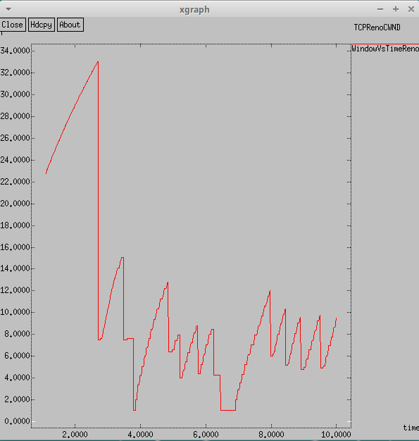
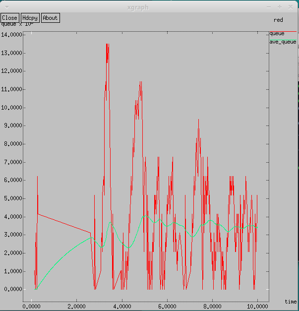
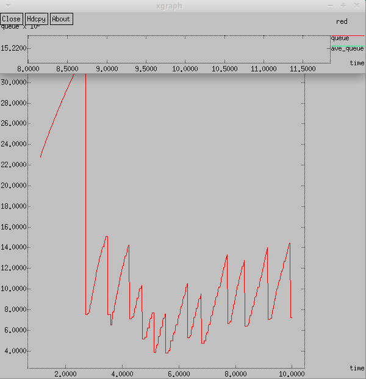
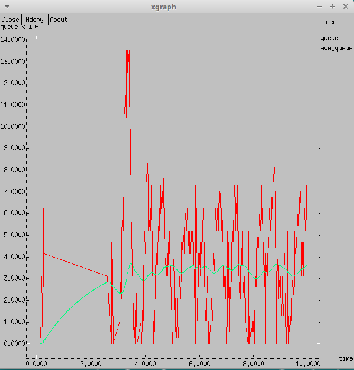
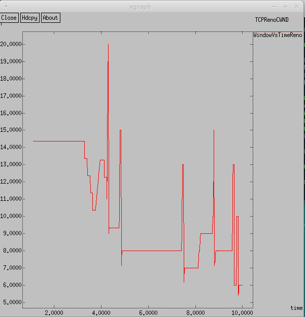
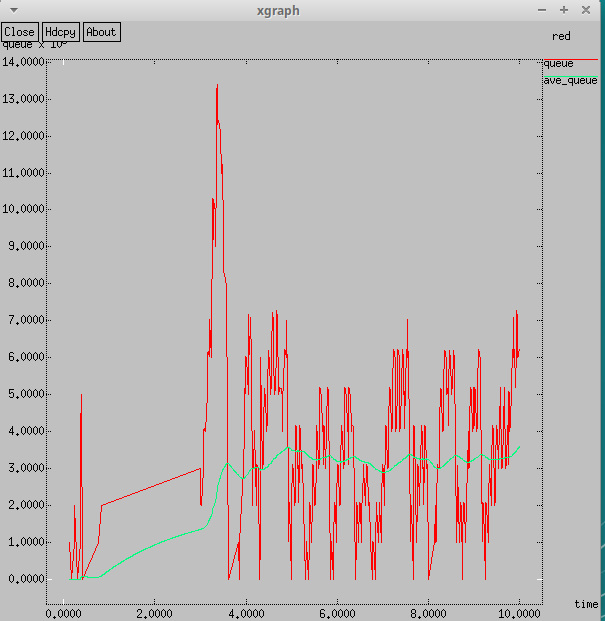
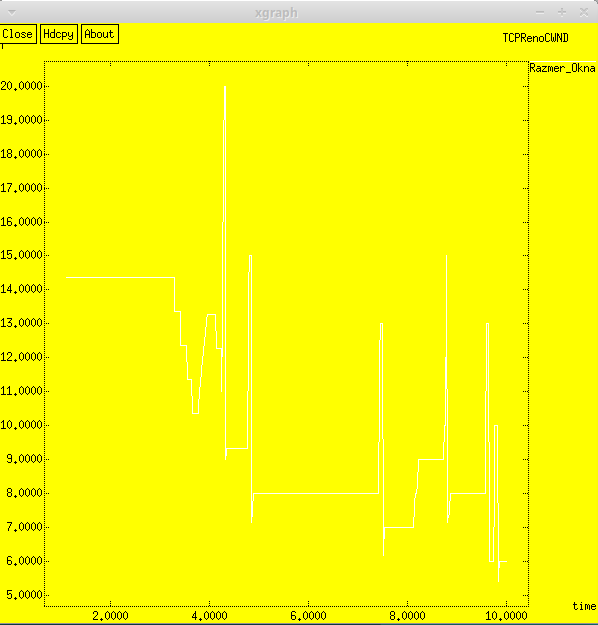
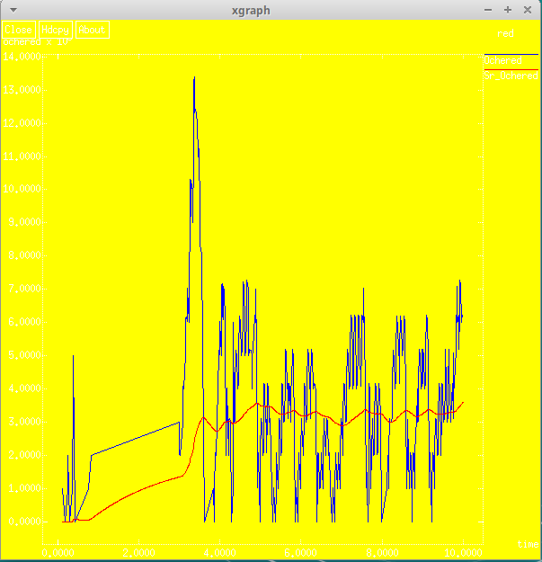

---
## Front matter
lang: ru-RU
title: Лабораторная работа 2
subtitle: Имитационное моделирование
author:
  - Шуваев Сергей Александрович
institute:
  - Российский университет дружбы народов, Москва, Россия

## i18n babel
babel-lang: russian
babel-otherlangs: english

## Formatting pdf
toc: false
toc-title: Содержание
slide_level: 2
aspectratio: 169
section-titles: true
theme: metropolis
header-includes:
 - \metroset{progressbar=frametitle,sectionpage=progressbar,numbering=fraction}
 - '\makeatletter'
 - '\beamer@ignorenonframefalse'
 - '\makeatother'
---

# Информация

## Докладчик

:::::::::::::: {.columns align=center}
::: {.column width="70%"}

  * Шуваев Сергей Александрович
  * студент
  * Российский университет дружбы народов
  * [1032224269@pfur.ru](mailto:1032224269@pfur.ru)
  * <https://Grinders060050.github.io/ru/>

:::
::: {.column width="25%"}

:::
::::::::::::::

## Цель работы

Разработать сценарий, реализующий схему моделируемой сети заданной в медотическом пособии, построить в Xgraph график изменения TCP-окна, график изменения длины очереди
и средней длины очереди.

## Постановка задачи

Описание моделируемой сети:
– сеть состоит из 6 узлов;
– между всеми узлами установлено дуплексное соединение с различными пропускной   способностью и задержкой 10 мс (см. рис. 2.4);
– узел r1 использует очередь с дисциплиной RED для накопления пакетов, максимальный   размер которой составляет 25;
– TCP-источники на узлах s1 и s2 подключаются к TCP-приёмнику на узле s3;
– генераторы трафика FTP прикреплены к TCP-агентам.
  Требуется разработать сценарий, реализующий модель согласно рис. 2.4, построить в   Xgraph график изменения TCP-окна, график изменения длины очереди
  и средней длины очереди.

# Выполнение лабораторной работы

## Реализация модели

{#fig:001 width=70%}

## Реализация модели

{#fig:002 width=40%}

## Упражнение :Изменим в модели на узле s1 тип протокола TCP с Reno на NewReno

{#fig:003 width=50%}

## Изменим в модели на узле s1 тип протокола TCP с Reno на NewReno

{#fig:004 width=40%}

## Изменим в модели на узле s1 тип протокола TCP с Reno на VEGAS

{#fig:005 width=50%}

## Изменим в модели на узле s1 тип протокола TCP с Reno на VEGAS

{#fig:006 width=70%}

## Внесем изменения при отображении окон с графиками (изменим цвет фона,цвет траекторий, подписи к осям, подпись траектории в легенде).

{#fig:007 width=50%}

## Внесем изменения при отображении окон с графиками (изменим цвет фона,цвет траекторий, подписи к осям, подпись траектории в легенде).

{#fig:008 width=50%}

## Выводы

В процессе выполнения данной лабораторной работы я исследовала протокол TCP и алгоритм управления очередью RED.