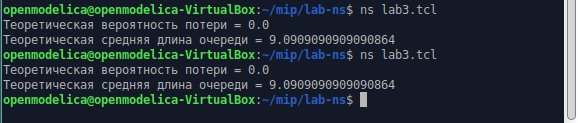
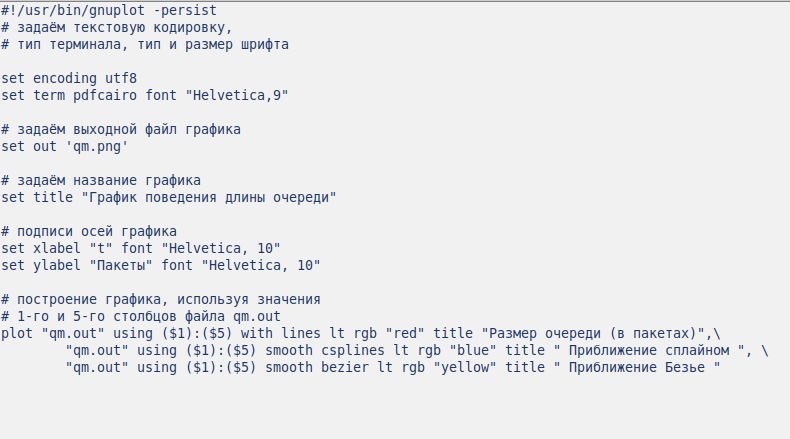
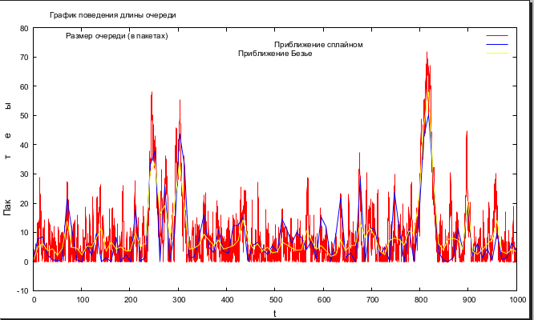

---
## Front matter
lang: ru-RU
title: Лабораторная работа 3
subtitle: Моделирование стохастических процессов

author:
  - Шуваев Сергей Александрович
institute:
  - Российский университет дружбы народов, Москва, Россия

## i18n babel
babel-lang: russian
babel-otherlangs: english

## Formatting pdf
toc: false
toc-title: Содержание
slide_level: 2
aspectratio: 169
section-titles: true
theme: metropolis
header-includes:
 - \metroset{progressbar=frametitle,sectionpage=progressbar,numbering=fraction}
 - '\makeatletter'
 - '\beamer@ignorenonframefalse'
 - '\makeatother'
---

# Информация

## Докладчик

:::::::::::::: {.columns align=center}
::: {.column width="70%"}

  * Шуваев Сергей Александрович
  * студент
  * Российский университет дружбы народов
  * [1032224269@pfur.ru](mailto:1032224269@pfur.ru)
  * <https://Grinders060050.github.io/ru/>

:::
::: {.column width="25%"}

:::
::::::::::::::

## Цель работы

3. Реализовать модель на NS-2

## Постановка задачи

1.Создать шаблон,открыть на редактирование.Вывести результат теоретической вероятности потери и теоритической средней длины очереди.
2.В каталоге с проектом создать отдельный файл, например, graph_plot.
Открыть его на редактирование и добавить код, обращая внимание
на синтаксис GNUplot.

# Выполнение лабораторной работы

## Реализация модели

{#fig:001 width=70%}

## Реализация модели

{#fig:002 width=40%}

## Упражнение :Сделать файл исполняемым. После компиляции файла с проектом, запустить
скрипт в созданном файле graph_plot, который создаст файл qm.pdf с результатами моделирования

{#fig:003 width=50%}

## Сделал файл исполнимым,запустил скрипт,который создал файл qm.pdf с результатами моделирования

{#fig:004 width=40%}

## Выводы

В процессе выполнения данной лабораторной работы я провел моделирование системы массового обслуживания (СМО).