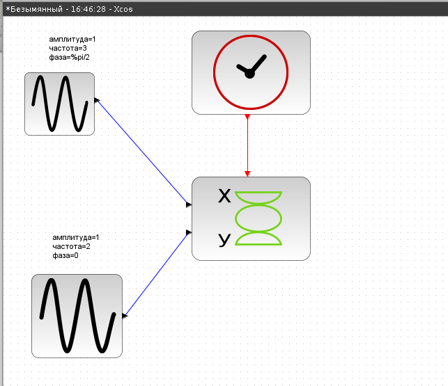

---
## Front matter
lang: ru-RU
title: Лабораторная работа 5
subtitle: Теоретические сведения Общее описание Scilab и xcos

author:
  - Шуваев Сергей Александрович
institute:
  - Российский университет дружбы народов, Москва, Россия

## i18n babel
babel-lang: russian
babel-otherlangs: english

## Formatting pdf
toc: false
toc-title: Содержание
slide_level: 2
aspectratio: 169
section-titles: true
theme: metropolis
header-includes:
 - \metroset{progressbar=frametitle,sectionpage=progressbar,numbering=fraction}
 - '\makeatletter'
 - '\beamer@ignorenonframefalse'
 - '\makeatother'
---

# Информация

## Докладчик

:::::::::::::: {.columns align=center}
::: {.column width="70%"}

  * Шуваев Сергей Александрович
  * студент
  * Российский университет дружбы народов
  * [1032224269@pfur.ru](mailto:1032224269@pfur.ru)
  * <https://Grinders060050.github.io/ru/>

:::
::: {.column width="25%"}

:::
::::::::::::::

## Цель работы

Постройте с помощью xcos фигуры Лиссажу со следующими параметрами:
1) A = B = 1, a = 2, b = 2, δ = 0; π/4; π/2; 3π/4; π;
2) A = B = 1, a = 2, b = 4, δ = 0; π/4; π/2; 3π/4; π;
3) A = B = 1, a = 2, b = 6, δ = 0; π/4; π/2; 3π/4; π;
4) A = B = 1, a = 2, b = 3, δ = 0; π/4; π/2; 3π/4; π.

# Выполнение лабораторной работы

## Упражнение

{#fig:001 width=40%}

## Упражнение 1

{#fig:002 width=40%}

## Упражнение

{#fig:003 width=40%}

## Упражнение

{#fig:004 width=40%}

## Упражнение

{#fig:005 width=40%}

## Упражнение

{#fig:006 width=40%}

## Упражнение 2

{#fig:007 width=40%}

## Упражнение

{#fig:008 width=40%}

## Упражнение 

{#fig:009 width=40%}

## Упражнение

{#fig:0010 width=40%}

## Упражнение

{#fig:0011 width=40%}

## Упражнение 3

{#fig:0012 width=40%}

## Упражнение

{#fig:0013 width=40%}

## Упражнение

{#fig:0014 width=40%}

## Упражнение

{#fig:0015 width=40%}

## Упражнение

{#fig:0016 width=40%}

## Упражнение 4

{#fig:0017 width=40%}

## Упражнение

{#fig:0018 width=40%}

## Упражнение

{#fig:0019 width=40%}

## Упражнение

{#fig:0020 width=40%}

## Упражнение

{#fig:0021 width=40%}

## Выводы

В процессе выполнения данной лабораторной работы получил навыки работы с программой Scilab и xcos.