---
## Front matter
title: "Лабораторная работа №5"
subtitle: "Теоретические сведения Общее описание Scilab и xcos"
author: "Шуваев Сергей Александрович"

## Generic otions
lang: ru-RU
toc-title: "Содержание"

## Bibliography
bibliography: bib/cite.bib
csl: pandoc/csl/gost-r-7-0-5-2008-numeric.csl

## Pdf output format
toc: true # Table of contents
toc-depth: 2
lof: true # List of figures
lot: false # List of tables
fontsize: 12pt
linestretch: 1.5
papersize: a4
documentclass: scrreprt
## I18n polyglossia
polyglossia-lang:
  name: russian
  options:
	- spelling=modern
	- babelshorthands=true
polyglossia-otherlangs:
  name: english
## I18n babel
babel-lang: russian
babel-otherlangs: english
## Fonts
mainfont: PT Serif
romanfont: PT Serif
sansfont: PT Sans
monofont: PT Mono
mainfontoptions: Ligatures=TeX
romanfontoptions: Ligatures=TeX
sansfontoptions: Ligatures=TeX,Scale=MatchLowercase
monofontoptions: Scale=MatchLowercase,Scale=0.9
## Biblatex
biblatex: true
biblio-style: "gost-numeric"
biblatexoptions:
  - parentracker=true
  - backend=biber
  - hyperref=auto
  - language=auto
  - autolang=other*
  - citestyle=gost-numeric
## Pandoc-crossref LaTeX customization
figureTitle: "Рис."
tableTitle: "Таблица"
listingTitle: "Листинг"
lofTitle: "Список иллюстраций"
lotTitle: "Список таблиц"
lolTitle: "Листинги"
## Misc options
indent: true
header-includes:
  - \usepackage{indentfirst}
  - \usepackage{float} # keep figures where there are in the text
  - \floatplacement{figure}{H} # keep figures where there are in the text
---

# Цель работы

Постройть с помощью xcos фигуры Лиссажу со следующими параметрами:
1) |A = B = 1, a = 2, b = 2, δ = 0;| π/4; |π/2; |3π/4;| π;|
2) |A = B = 1, a = 2, b = 4, δ = 0;| π/4; |π/2; |3π/4;| π;|
3) |A = B = 1, a = 2, b = 6, δ = 0;| π/4; |π/2; |3π/4;| π;|
4) |A = B = 1, a = 2, b = 3, δ = 0;| π/4; |π/2; |3π/4;| π;|

# Задание

Выполнить 4 упражнения с помощью xcos фигуры Лиссажу.

# Выполнение лабораторной работы

Математическое выражение для кривой Лиссажу:
x(t) = A sin(at + δ),
y(t) = B sin(bt),
где A, B — амплитуды колебаний, a, b — частоты, δ — сдвиг фаз.
В модели, изображённой на рис. II.1.3, использованы следующие блоки xcos:
– CLOCK_c — запуск часов модельного времени;
– GENSIN_f — блок генератора синусоидального сигнала;
– CANIMXY — анимированное регистрирующее устройство для построения графика
типа y = f(x);
– TEXT_f — задаёт текст примечаний.
Предположим, что в модели заданы следующие параметры: A = B = 1, a = 3,
b = 2, δ = π/2. Получим график, изображённый на рис. II.1.4

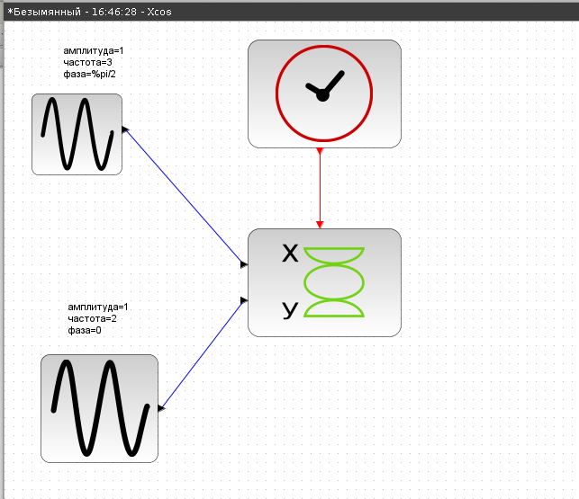{#fig:001 width=40%}

## Упражнение 1

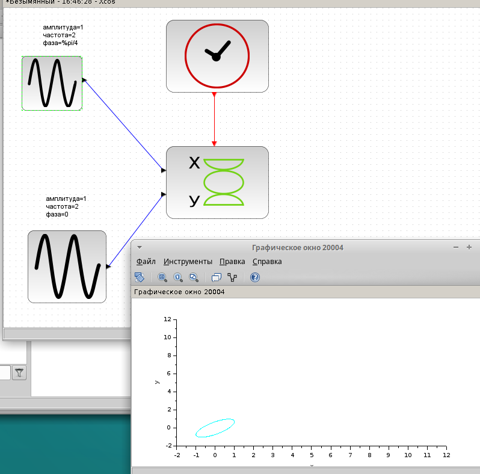{#fig:002 width=40%}

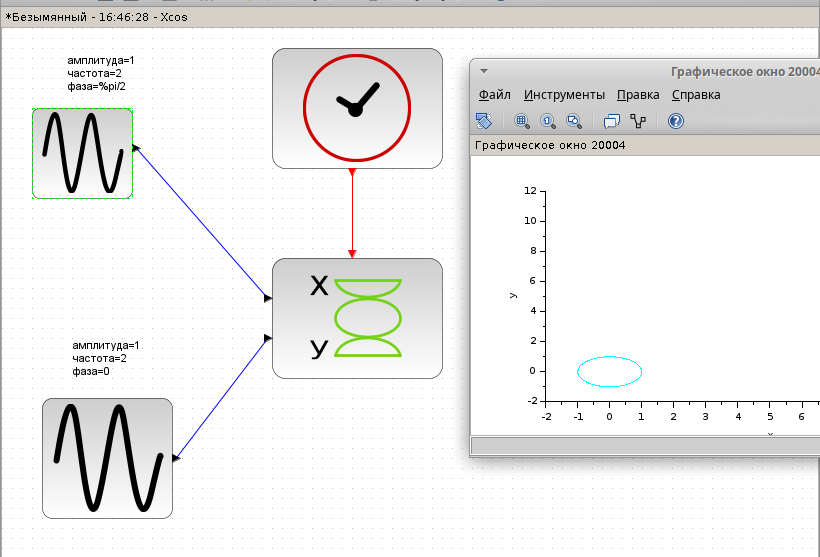{#fig:003 width=50%}

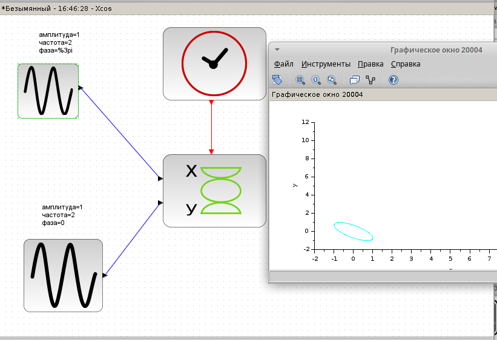{#fig:004 width=40%}

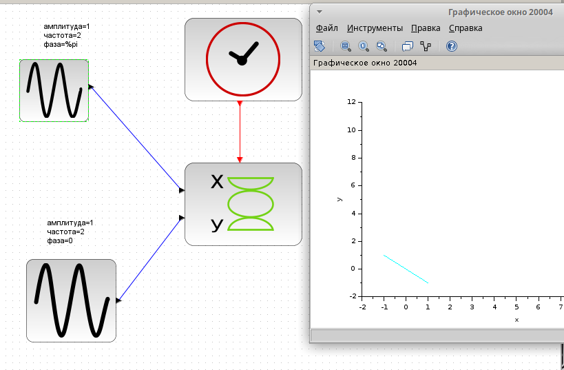{#fig:005 width=40%}

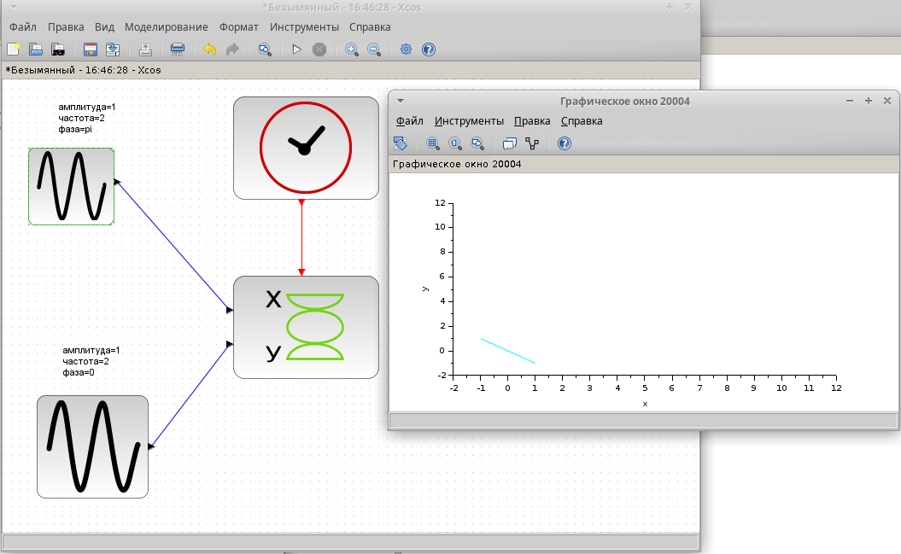{#fig:006 width=40%}

## Упражнение 2

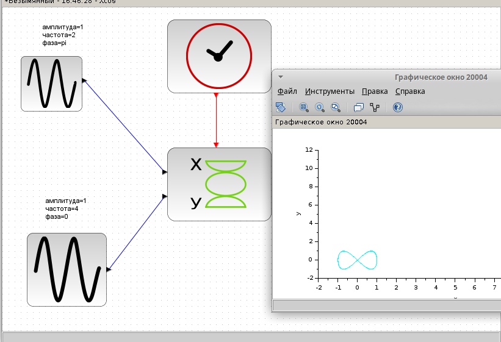{#fig:007 width=40%}

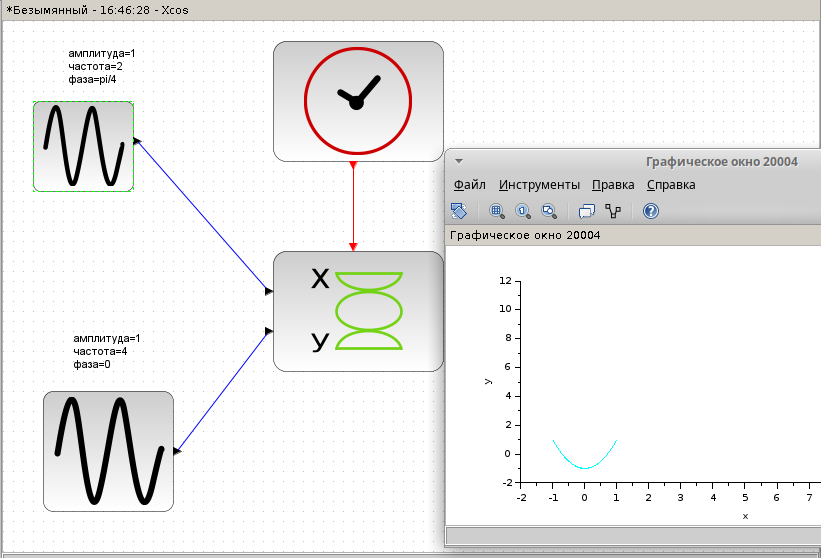{#fig:008 width=40%}

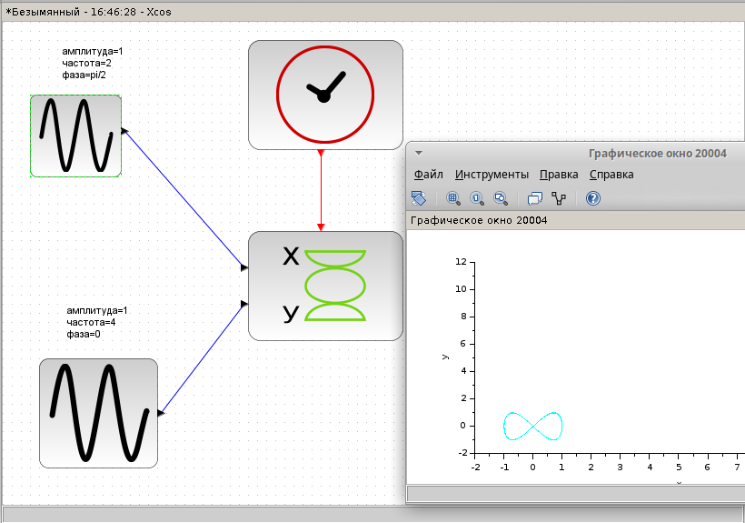{#fig:009 width=40%}

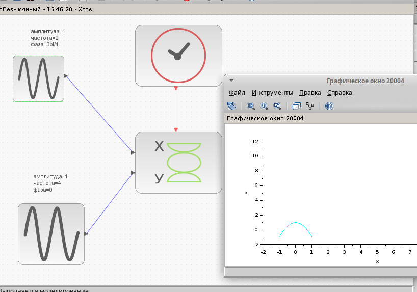{#fig:0010 width=40%}

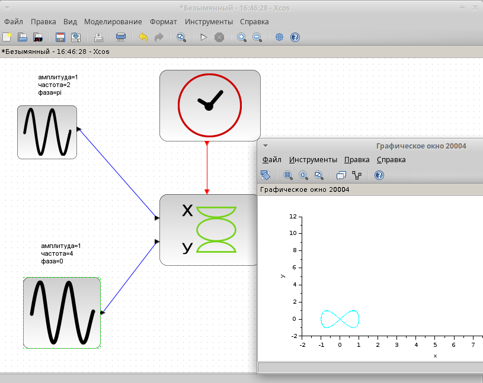{#fig:0011 width=40%}

## Упражнение 3

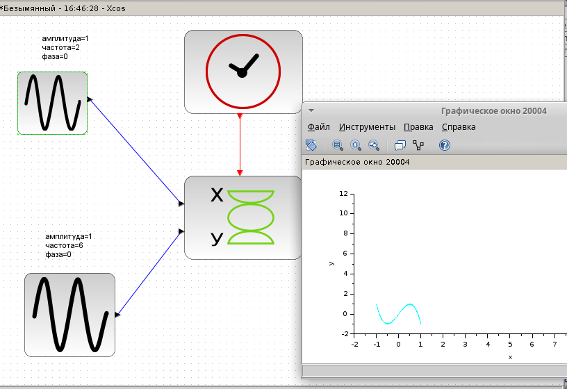{#fig:0012 width=40%}

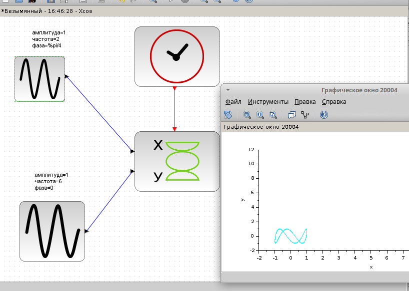{#fig:0013 width=40%}

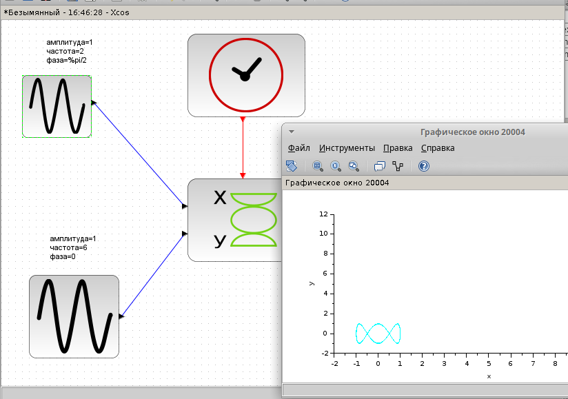{#fig:0014 width=40%}

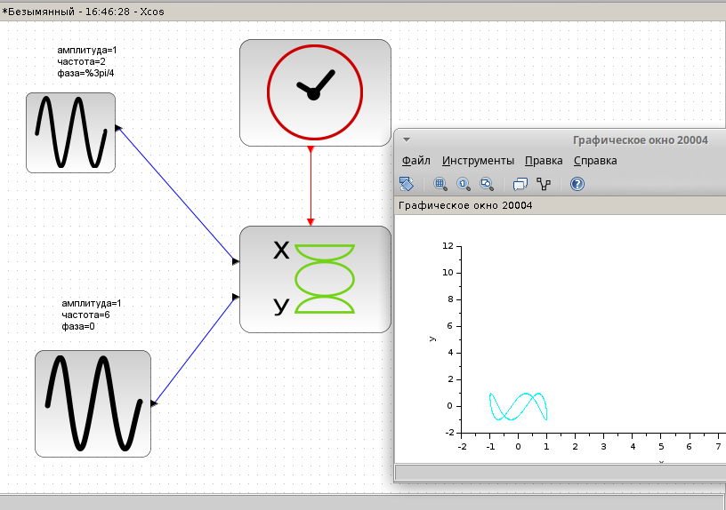{#fig:0015 width=40%}

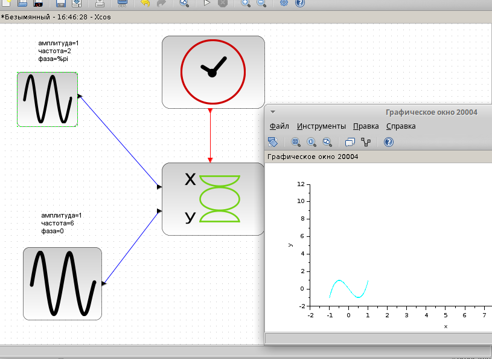{#fig:0016 width=40%}

## Упражнение 4

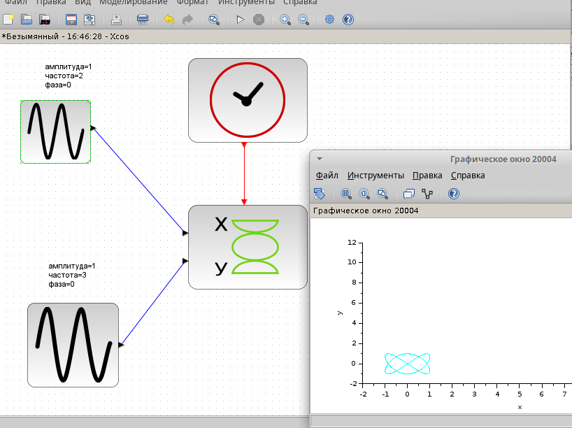{#fig:0017 width=40%}

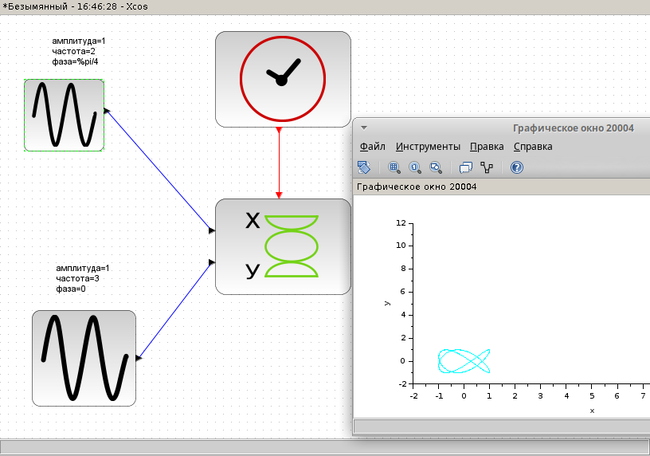{#fig:0018 width=40%}

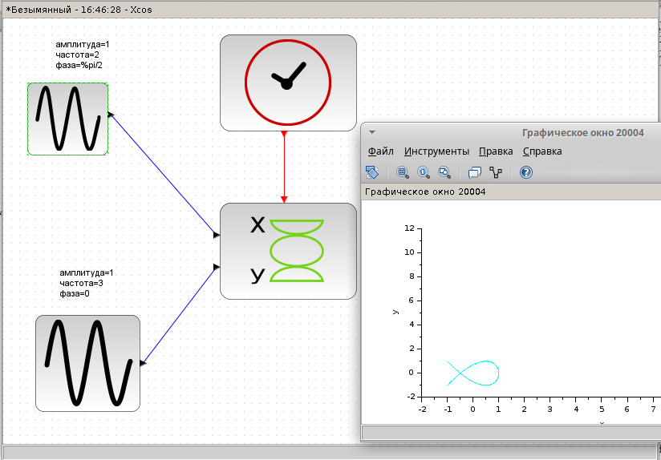{#fig:0019 width=40%}

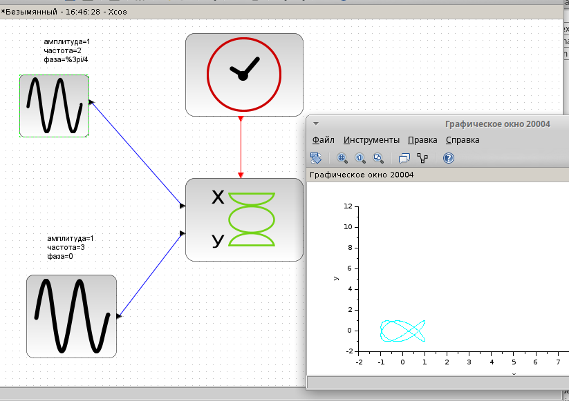{#fig:0020 width=40%}

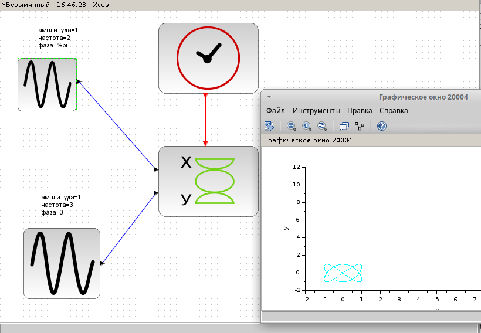{#fig:0021 width=40%}

## Выводы

В процессе выполнения данной лабораторной работы получил навыки работы с программой Scilab и xcos.